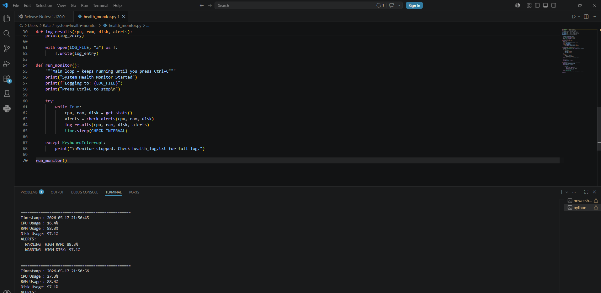
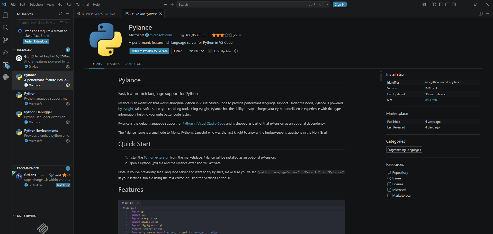

# Python System Health Monitor

## Overview
Python script that monitors CPU, RAM, and disk usage in real time,
logs timestamped results to a file, and alerts when usage is too high.

## Tools Used
- Python 3.12
- psutil library
- VS Code

## How to Run
pip install psutil
python health_monitor.py

## Skills Demonstrated
- Python scripting and automation
- System administration concepts
- File I/O and logging
- Threshold-based alerting

## Screenshots

